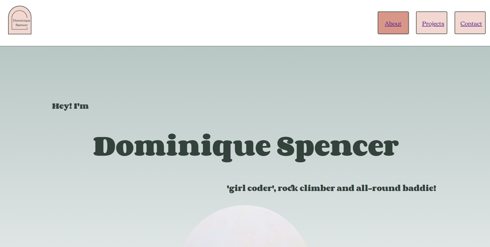
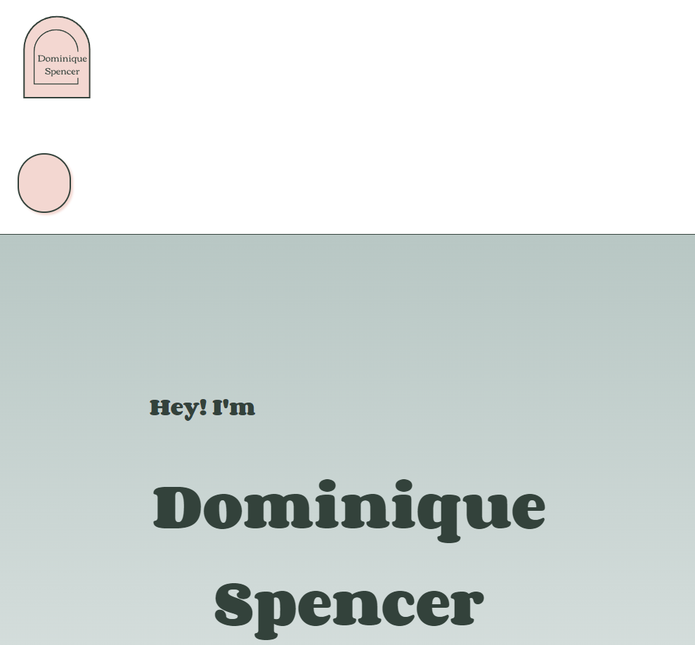
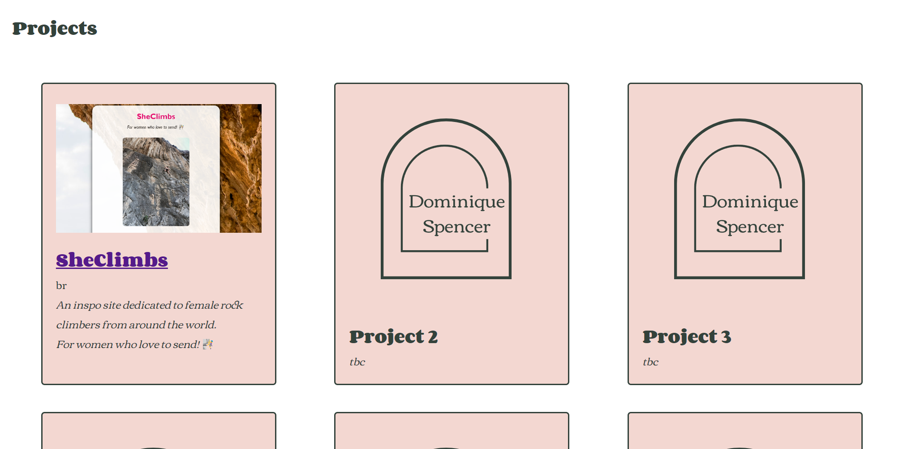
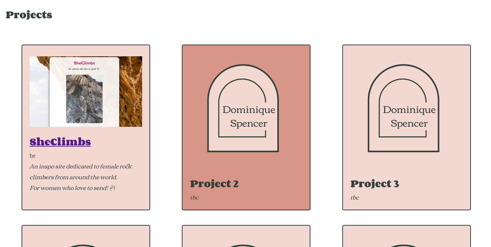
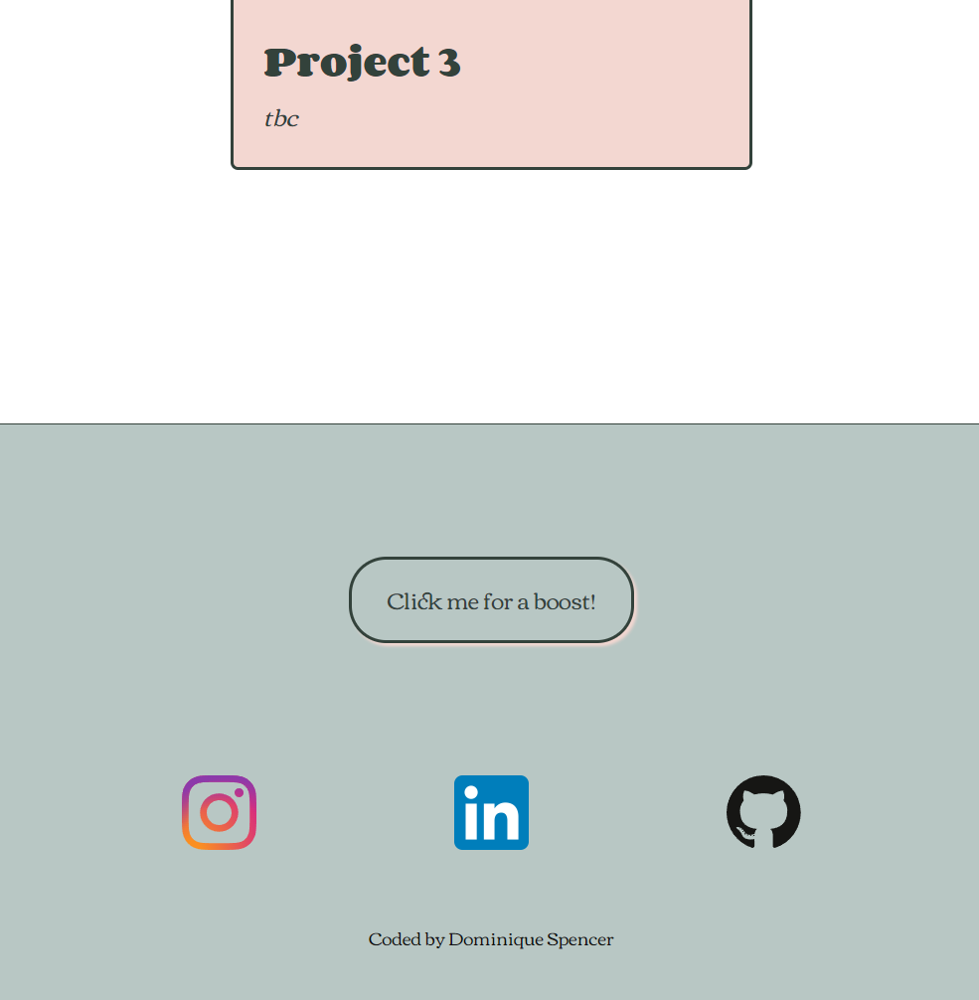
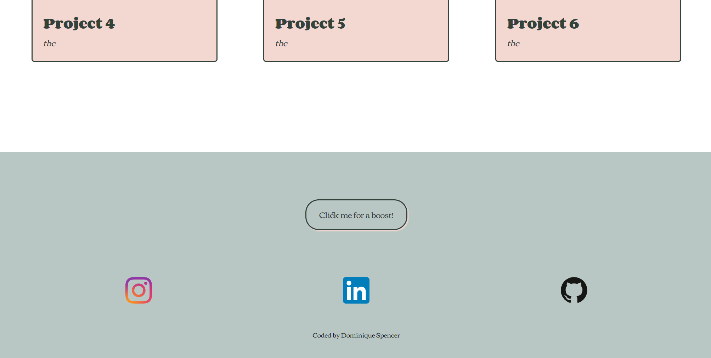
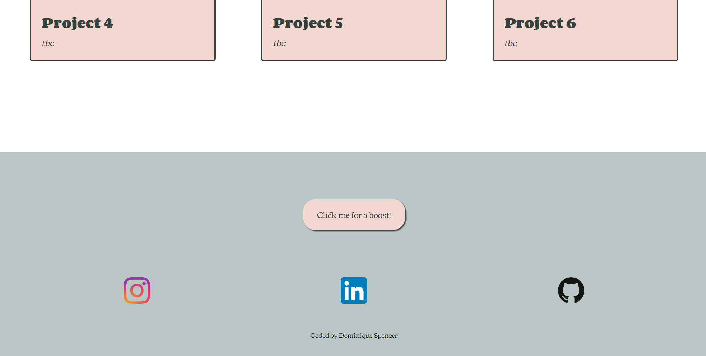
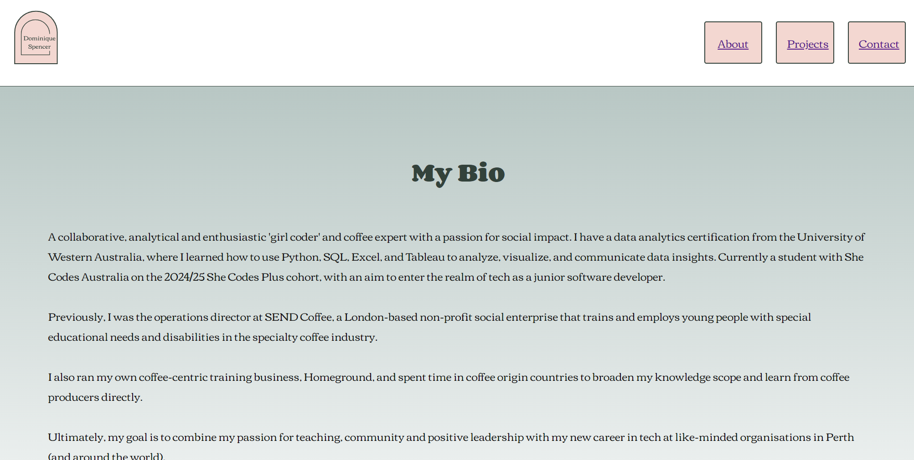
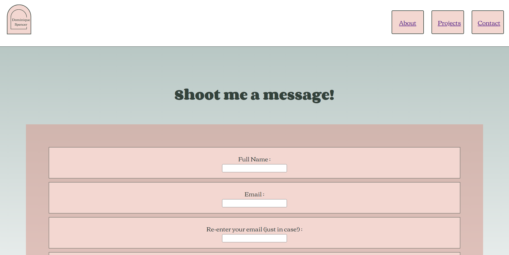
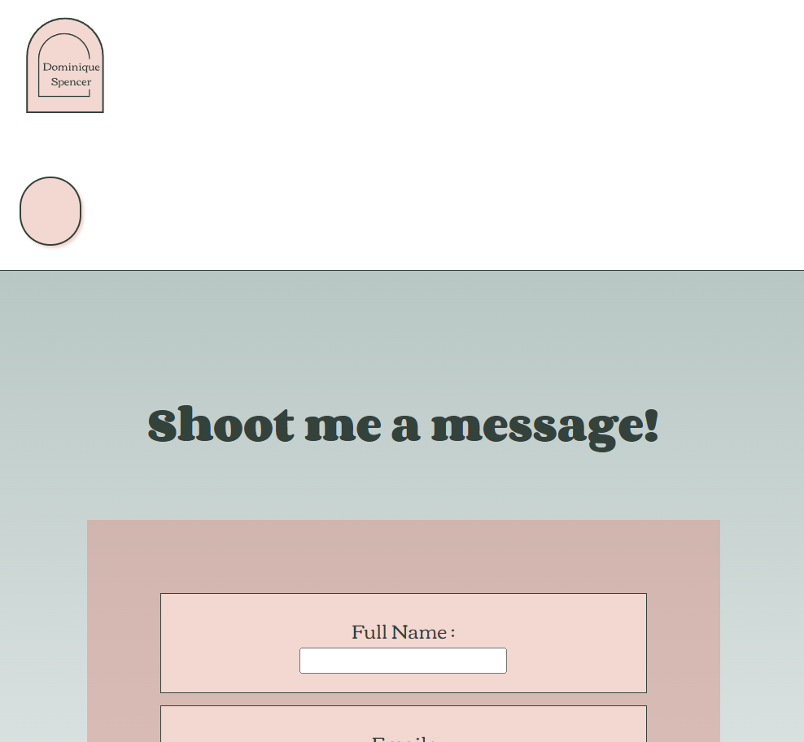

#  ✨ Dominique Spencer - Portfolio Project ✨
​
[Dominique's Portfolio](https://domspenc.github.io/)

​
## Project Requirements

### Content
#### Add a short paragraph describing the features below. What aesthetic and technical choices did you make?
✔️ <em>At least one profile picture.</em>  
I chose to edit my image to be a more interesting shape, that matched the shape of my makeshift logo for consistency.

✔️ <em>Biography (at least 100 words).</em>  
This was a copy / paste job from LinkedIn, however it is up to date and tells a bit more of my story!

✔️ <em>Functional Contact Form.</em>  
Added a basic form and connected it to FormSpree. Styled it to help with readability.

✔️ <em>"Projects" section.</em>  
I added a projects 'page' to my site but didn't end up including it as a separate page (OTT) so I added an anchor to the link to guide the user to the 'Projects' section on the main page more easily.

✔️ <em>Links to external sites, e.g. GitHub and LinkedIn.</em>  
Added these links to my footer to make them pop and keep them away from the main content.

​
### Technical
#### Add a short paragraph describing the features below. What strategies or design decisions did you work from?
✔️ <em>At least 2 web pages.</em>  
I added a nav bar with 3 different links but only created separate pages for 'About' and 'Contact'.

✔️ <em>Version controlled with Git.</em>  
Forgot to save, commit and push as often as I should have but thankfully I didn't lose any work! This is a work in progress for me.

✔️ <em>Deployed on GitHub pages.</em>  
Successfully deployed!

✔️ <em>Implements responsive design principles.</em>  
Flexbox and media queries are still a work in progress for me, but I played with both and managed to get some positive results including:
- Displaying fewer Projects (dropping from 6 to 3) as the page size reduces
- Hiding the hamburger menu as the page size reduces (although the menu is not in the right location and still isn't functional!)

✔️ <em>Uses semantic HTML.</em>  
As semantic as made sense to me, hopefully it makes sense to you, too!

### Bonus (optional)
#### Add a short paragraph describing the features below, if you included any.
✔️ <em>Different styles for active, hover and focus states.</em>  
Nav bar links, project tiles and buttons change on hover.

✔️ <em>Include JavaScript to add some dynamic elements to your site. (Extra tricky!)</em>  
I added a fun little interactive pop-down using Javascript when the #baddieButton (at the bottom of the main page) is clicked.
It needs a few improvements (like if someone types something other than 'yes' or 'no') but it's a start! Try it for yourself!

### Other
There are a number of features that do not work as intended and are in need of work in future, namely the hamburger button (location when in mobile view, and functionality).

​
### Screenshots

### Main Page  

#### Main Page - Nav Bar Hover

#### Main Page - Mobile

---

### Projects Section  

#### Projects Section - Hover  

#### Projects Section - Mobile

---

### Footer Section  

#### Footer Section - Button Hover  

---

### About Page  

---

### Contact Page  

#### Contact Page  - Mobile

---

 
 

  
Logo created with Canva Logo Maker

