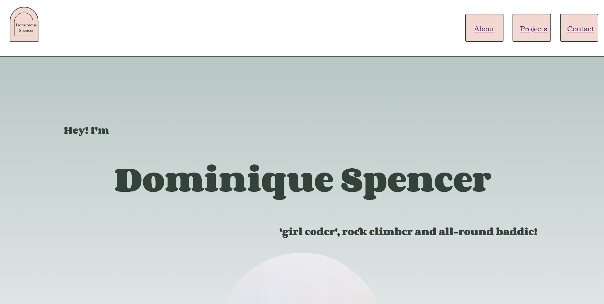

#  your_name_here - Portfolio Task
​
[My portfolio site](link_to_your_site)
​
## Project Requirements

### Content
#### Add a short paragraph describing the features below. What aesthetic and technical choices did you make? 
✔️ At least one profile picture
I chose to edit my image to be a more interesting shape, that matched the shape of my makeshift logo for consistency.

✔️ Biography (at least 100 words)
This was a copy / paste job from LinkedIn, however it is up to date and tells a bit more of my story!

✔️ Functional Contact Form
Added a basic form and connected it to FormSpree. Styled it to help with readability.

✔️ "Projects" section
I added a projects 'page' to my site but didn't end up including it as a separate page (OTT) so I added an anchor to the link to guide the user to the 'Projects' section on the main page more easily.

✔️ Links to external sites, e.g. GitHub and LinkedIn.
Added these links to my footer to make them pop and keep them away from the main content.

​
### Technical
#### Add a short paragraph describing the features below. What strategies or design decisions did you work from? 
✔️ At least 2 web pages.
I added a nav bar with 3 different links but only created separate pages for 'About' and 'Contact'.

✔️ Version controlled with Git
Forgot to save, commit and push as often as I should have but thankfully I didn't lose any work! This is a work in progress for me.

✔️ Deployed on GitHub pages.
Successfully deployed!

✔️ Implements responsive design principles.
Flexbox and media queries are still a work in progress for me, but I played with both and managed to get some positive results including:
- Displaying fewer Projects (dropping from 6 to 3) as the page size reduces
- Hiding the hamburger menu as the page size reduces (although the menu is not in the right location and still isn't functional!)

✔️ Uses semantic HTML.
As semantic as made sense to me, hopefully it makes sense to you, too!

### Bonus (optional)
#### Add a short paragraph describing the features below, if you included any. 
✔️ Different styles for active, hover and focus states.
Nav bar links, project tiles and buttons change on hover.

✔️ Include JavaScript to add some dynamic elements to your site. (Extra tricky!)
I added a fun little interactive pop-down using Javascript when the #baddieButton (at the bottom of the main page) is clicked.
It needs a few improvements (like if someone types something other than 'yes' or 'no') but it's a start! Try it for yourself!
​
### Screenshots
> Please include the following:
> - The different pages and features of your website on mobile, tablet and desktop screen sizes (multiple screenshots per page and screen size).
> - The different features of your site, e.g. if you have hover states, take a screenshot that shows that.  
> 
> You can do this by saving the images in a folder in your repo, and including them in your readme document with the following Markdown code: 

#### Main page  
